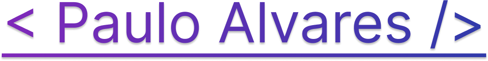

  

  <a href="#">Português</a> · <a href="/docs/README_EN.md">English</a> · <a href="/docs/README_ES.md">Español</a>

<h2 align="center">👋 Sobre Mim</h2>

  Sou <strong>Assistente de Dados</strong> no <strong>Mercado Livre</strong>, com formação em <strong>Análise e Desenvolvimento de Sistemas</strong> e uma base sólida em <strong>engenharia de software</strong>. Apaixonado por tecnologia, música, e pokémon!

<h2 align="center">🎓 Formação</h2>

<table align="center">
  <tr>
    <td valign="top" width="min-content">
      <h3 align="center">🤓 Técnico</h3>
      

        Desenvolvimento de Sistemas   
        &nbsp;&nbsp;&nbsp;&nbsp;&nbsp;&nbsp;&nbsp;Etec Dr. Celso Giglio (Osasco II)&nbsp;&nbsp;&nbsp;&nbsp;&nbsp;&nbsp;&nbsp;  
        2019 - 2021   
        
      

    </td>
    <td valign="top" width="min-content">
      <h3 align="center">🎓 Graduação</h3>
      

        Análise e Desenvolvimento de Sistemas   
        São Paulo Tech School (SPTech)  
        2022 - 2024   
        
      

    </td>
    <td valign="top" width="min-content">
      <h3 align="center">📚 Formação Online</h3>
      

        &nbsp;&nbsp;&nbsp;&nbsp;&nbsp;&nbsp;&nbsp;&nbsp;&nbsp;&nbsp;Desenvolvimento Full Stack&nbsp;&nbsp;&nbsp;&nbsp;&nbsp;&nbsp;&nbsp;&nbsp;&nbsp;&nbsp;   
        Rocketseat  
        2025   
        
      

    </td>
  </tr>
</table>

<h2 align="center">💛 Carreira</h2>

<table align="center" width="100%">
  <tr>
    <td valign="top" width="min-content">
      <h3 align="center">&nbsp;&nbsp;&nbsp;💜 Accenture&nbsp;&nbsp;&nbsp;&nbsp;</h3>
      

        Estagiário   
        2023 - 2024   
        
      

    </td>
    <td valign="top" width="max-content">
      <h3 align="center">💛 Mercado Livre</h3>
      

        Assistente de Dados   
        2025 - Atual   
        
      

    </td>
  </tr>
</table>

<h2 align="center">🧑🏼‍💻 Tecnologias</h2>

<table align="center">
  <tr>
    <td valign="top" width="20%">
      <h3 align="center">Front-End</h3>
      

        
      

    </td>
    <td valign="top" width="20%">
      <h3 align="center">Back-End</h3>
      

        
      

    </td>
    <td valign="top" width="20%">
      <h3 align="center">Database</h3>
      

        
      

    </td>
    <td valign="top" width="20%">
      <h3 align="center">Cloud</h3>
      

        
      

    </td>
    <td valign="top" width="20%">
      <h3 align="center">Tools</h3>
      

        
      

    </td>
  </tr>
</table>

<h2 align="center">📚 Estudando...</h2>

<table align="center">
  <tr>
    <td valign="top" width="50%">
      <h3 align="center">✏️ My Learn Hub</h3>
      

        Organização dedicada a todos os cursos, certificações, bootcamps e eventos online que participei. Aqui está a trajetória completa do meu aprendizado autodidata.   
        
      

    </td>
    <td valign="top" width="50%">
      <h3 align="center">🎒 SPTech Learn</h3>
      

        Organização dedicada a projetos, documentações, apontamentos e estudos realizados durante minha graduação em Análise e Desenvolvimento de Sistemas na SPTech.   
        
      

    </td>
  </tr>
</table>

<!-- <h2 align="center">📊 Status</h2>

  
  

 -->

<h2 align="center">📫 Fale Comigo</h2>

 
  
   
  

